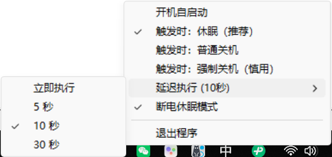

# AC-Trigger
检测笔记本电脑的交流电源连接状态，并在外部电源断开时自动触发休眠或关机操作。

Detect the AC power connection status of the laptop and automatically trigger hibernation or shutdown when external power is disconnected.

# 功能展示
